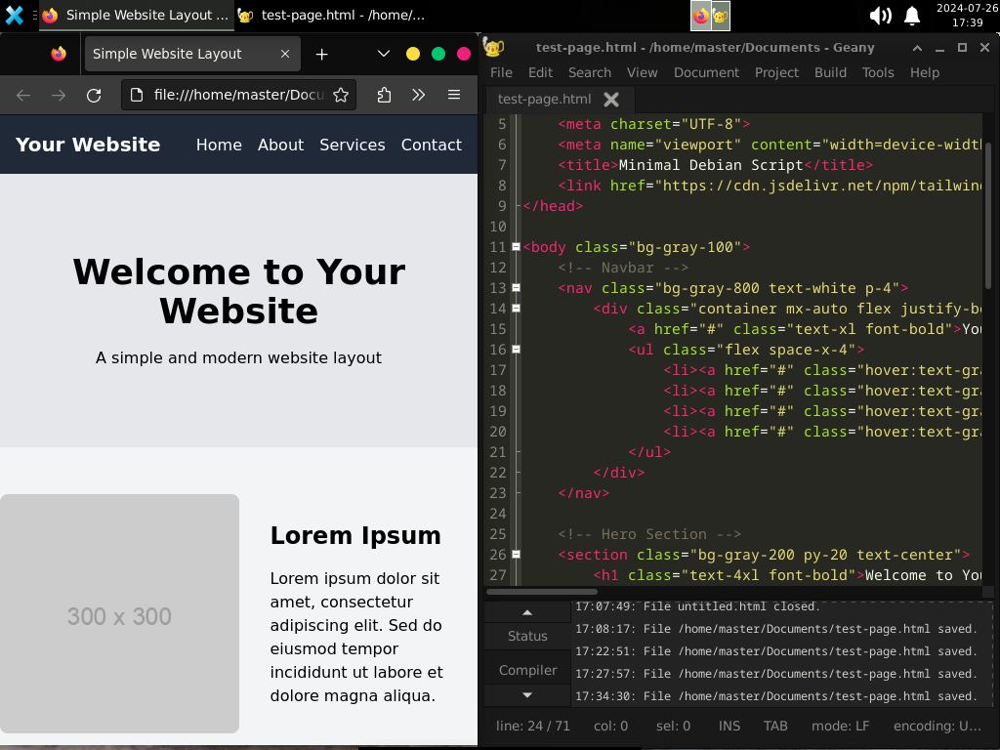
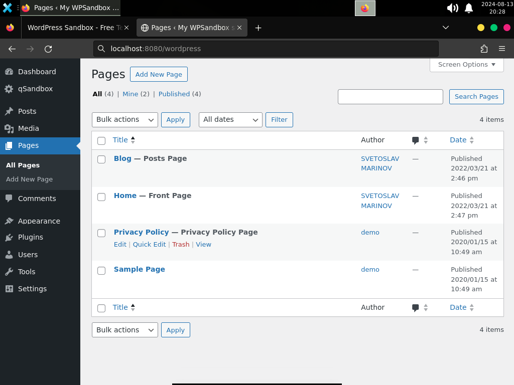

# Minbian

Minbian is a free and open-source installation script written in Bash for setting up a minimal desktop setup on Debian GNU/Linux (and derivatives), automating the process and oriented to: developers, users with low-end hardware, or anybody willing to avoid bloatware (without losing usability). It lets you choose what to install based on input, apart from some ready tools. You can get nice and solid setups up and running within minutes: from just a DE and browser on a netbook, to an office-oriented workstation, and even a full development environment.

## The name

"Minbian" setups are called this way since their goal is not to create "yet another Debian fork" but a minimal setup that is flexible, fast and secure. The project's got a namesake pet on the logo showing a snow fox pup (or a wolf, whatever you think it is) with the Debian emblem on the eye. Minbian represents how small yet powerful the Debian experience can be.

## Distributions

Minbian will work perfectly on:

- Debian (from version 12)
- Devuan (from version 5)
- AntiX (Core & Net editions)
- Sparky Linux (MinimalCLI)

Minbian is not oriented to:

- Ubuntu, Pop! OS, and forced GUI distros.

Minbian can be adapted (by code editing) to:

- Arch Linux (and minimal derivatives)
- OpenSUSE ("Server Role" install mode)
- Fedora Linux (Core edition)

## Usage

After installing the base system, you download and run the script, answer yes or no (y/n) a couple times, and let Minbian add everything you'll need automatically. No bloatware, no ricing, no tracking involved.

- Boot from an USB or ISO image and install the base system
- Select your time zone, language and package management repos
- Uncheck all the desktop environments, but keep "system utilities"
- Finish the installation, reboot, select your system, and login

### Next Steps

- [ ] Install 'sudo' (if not done yet)

```
apt install sudo
sudo usermod -aG sudo your_name
```

- [ ] Switch user as root to continue

```
su your_name
```

- [ ] Install Git and download the files

```
sudo apt-get install git
git clone https://github.com/alexmolinaws/minbian.git
```

- [ ] Open the folder and run ./main.sh

```
cd /minbian
sudo ./main.sh
```

- [ ] Answer to select software, for example:

```
Do you need a code editor? (y/n)
```

- [ ] Let it finish, then reboot your PC.

## Requirements

### Hardware

- Minimum CPU: 1 core at 1.6 Ghz, and 512 Kb of cache memory
- Minimum RAM: at least 2 Gb (for 32-bit) or 4 Gb (for 64-bit)
- Mimimum Storage: at least 16 Gb for the root partition
- Swap partition: 2 Gb for users with 4 Gb (or less) of RAM

##### Note

Minbian works on x86 and x64 architectures, but you need to select the right ISO image. It's been tested on both new and (very) old hardware. On ARM64 and other processors it should work, but testing hasn't been performed yet.

## Screenshots

### Overview


### Look & Feel


### Development




### Other Apps




## Software Included

### Crucial Packages

- Display Server by X.Org
- Firewall Manager (UFW)
- System monitoring tools
- System daemons & commands

### Default Desktop

- Login Manager (LightDM)
- Desktop Environment (Xfce)
- Terminal emulator (by Xfce)
- APT modern CLI front-end (Nala)
- Audio, location, & more plugins
- Files explorer/manager (Thunar)
- System fonts for compatibility
- A light calculator (Galculator)
- Images, videos, & PDF viewers
- Screenshoots tool (by Xfce)
- A music player (Rhythmbox)
- FOSS web browser (Firefox)

### Optional Packages

- Bluetooth drivers and utilities
- A minimal code/text editor (Pluma)
- Development software (Sublime Text)
- The LibreOffice suite (x64 only)
- Design software (Inkscape, GIMP)

### Additional

- 2 wallpaper options in folder

## Recommendations

- Check the specifications of your computer before installing this setup, they provide useful information to get the best installation experience, and some steps rely on that.
- If the setup you're looking for is meant to play specific videogames or performing complex activities this might not cover out of the box, verify using Minbian is right for you.