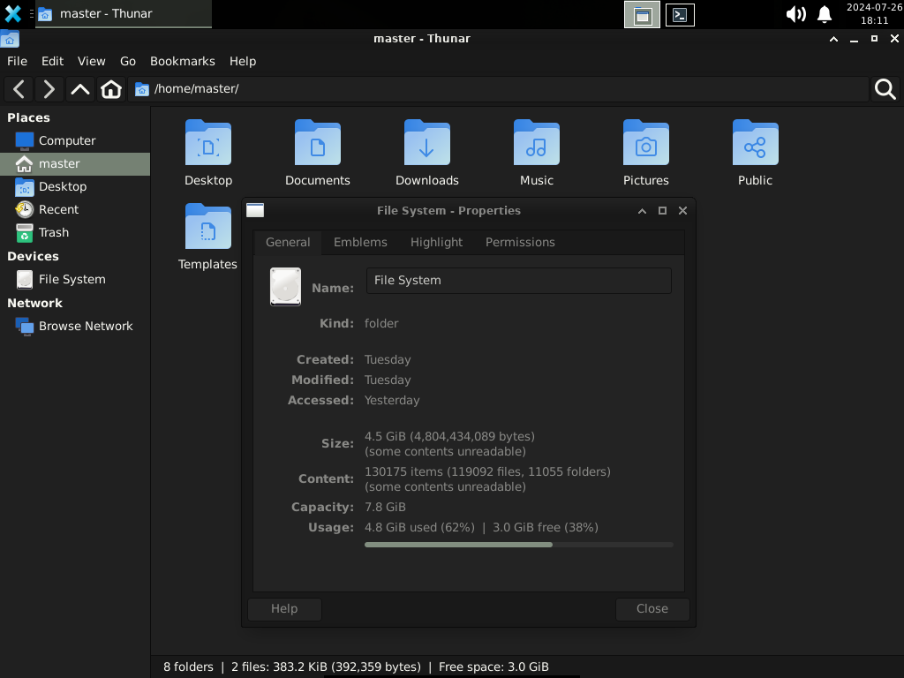

# Minbian

Minbian is a free and open-source installation script written in Bash for setting up a lightweight, minimal desktop setup on Debian GNU/Linux systems (and derivatives), automating the customization process of your OS and oriented to: software developers, users with low-end hardware, or anybody wanting to try Debian without a bloated installation yet looking for an overall user-friendly experience. It lets you choose what to install based on input, apart from the ready-to-go desktop tools. You can get nice and solid setups up and running within minutes: from just a DE and browser on a netbook, or an office-oriented workstation, to a robust development environment.

## The name

"Minbian" setups are called this way since their goal is not to create "yet another Debian fork" but a minimal Debian installation that is flexible, fast and secure. The project's got a namesake pet on the logo showing a snow fox pup (or a wolf, dog, coyote, anyone the user sees it like since it's their computer) with the Debian spiral on the eye. Minbian represents how small yet powerful and easy the Debian experience can be, with an average of 1200 packages.

## Usage

If you're an user who likes minimalism, stability, security, and customization (which is basically what most of GNU/Linux users appreciate to have) but don't like wasting hours installing (or removing) stuff on your own, Minbian can do wonders for you.

After installing the base system, you download and run the script, answer yes or no (y/n) a couple times, and let Minbian add everything you'll need automatically. No bloatware, no ricing, no tracking.

### Previous Steps

- Boot from a flash USB or ISO image and install the Debian base system for your architecture
- Select the best location for time, language and package management as it will ask you to
- Uncheck all the desktop environments when asked, but keep "system utilities" (important)
- Finish the installation, reboot, select Debian (if you installed GRUB) and login as root

### Installation

- [ ] Install the 'sudo' command

```
apt install sudo
sudo usermod -aG sudo your_name
```

- [ ] Switch user from root to continue

```
su your_name
```

- [ ] Install Git and download the files

```
sudo apt-get install git
git clone https://github.com/alexmolinaws/minbian.git
```

- [ ] Open the directory and run main.sh

```
cd /minbian
sudo ./main.sh
```

- [ ] Answer to select software, for example:

```
Do you need a code editor? (y/n)
```

- [ ] Give it some minutes, then reboot.

## Requirements

### Hardware

- Recommended CPU: at least 1 core with 1.6 Ghz of frequency and 512 Kb of cache memory is required
- Recommended RAM: having at least 2 Gb (for 32-bit) or 4 Gb (for 64-bit) of RAM is recommended
- Recommended ROM: 16 Gb is the minimum required for the root partition (where the OS & apps live)
- Swap partition: having at least 2 Gb for users with less than 4 Gb of total RAM is recommended

##### Note

Minbian works perfectly on both x86 and x64 architectures, it's been tested on both brand new and (very) old hardware (like Atom processors with 1 GB of RAM and no graphics card); same as in virtual machines (from versions 9 to 12 of Debian Stable). Testing on ARM64 and other processors has not been performed yet, but all chosen packages and settings have been studied to ensure compatibility.

## Screenshots

### Overview


### Look & Feel




### Development


### Other Apps


## Software Included

### Crucial Packages

- Display Server by X.Org
- Firewall Manager (UFW)
- System monitoring tools
- System daemons and commands

### Default Desktop

- Login Manager (LightDM)
- Desktop Environment (Xfce)
- Terminal emulator (2 options)
- Audio, places and more plugins
- Files explorer/manager (Thunar)
- APT modern CLI front-end (Nala)
- System fonts for compatibility
- A light calculator (Galculator)
- Images, videos and PDF viewers
- Screenshooter tool (by Xfce)
- A music player (Rhythmbox)
- FOSS web browser (Firefox)

##### Note:

These packages form the Minbian setup core apps, tho things like the media player and browser are up to you to keep or replace. The installation includes *Firefox ESR* as the default browser since it's proven to be stable, secure, and resources-friendly. It also includes the *Xfce Terminal* and *XTerm* emulators for the command line; yet keeping both is recommended for practical reasons.

### Optional Packages

- Bluetooth drivers and utilities
- A minimal code/text editor (Pluma)
- Development software (Sublime Text)
- The LibreOffice suite (x64 only)
- Design software (Inkscape, GIMP)

### Aditional

- 2 wallpaper options in folder

## Recommendations

- Check the specifications of your computer before installing this setup, they provide useful information to get the best installation experience, and some steps rely on that.
- If you're unsure, feel free to read the script and compare the packages Minbian includes with the ones listed on the [Debian Wiki](https://www.debian.org/distrib/packages). Never install software you can't trust.
- If you're customizing the scripts before installing, modifying any lines you don't understand is not recommended. It's better to "tweak it" once it's solid and done.
- If the setup you're looking for is meant to play specific videogames or performing complex activities this might not cover out of the box, verify using Minbian is right for you.
